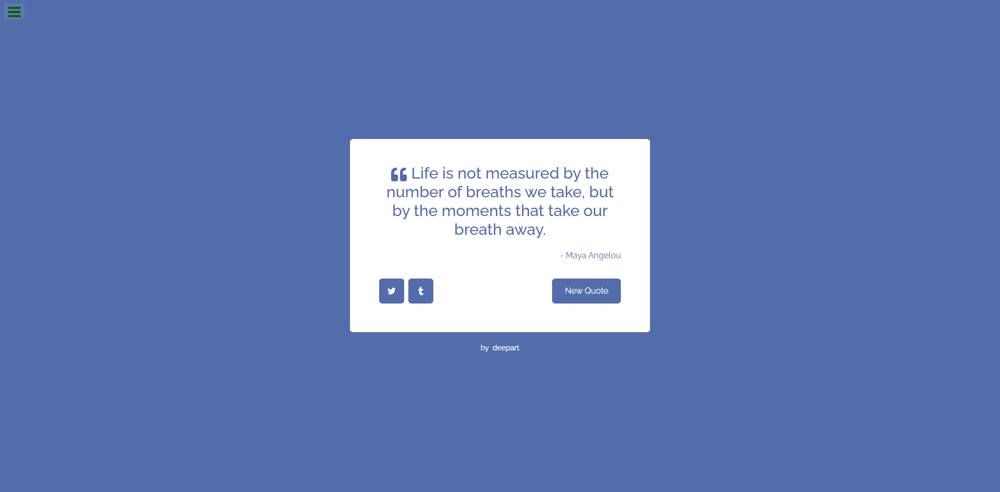

# Random Quote Machine

A responsive web application built as part of the **freeCodeCamp Front End Development Libraries** certification. The application displays random inspirational quotes and allows users to generate new quotes and share them on Twitter.

## 📸 Preview

## ✨ Features

- Generate random quotes
- Display author information
- Share quotes on Twitter
- Responsive design
- Meets all freeCodeCamp project requirements

## 🛠 Tech Stack

- React
- JavaScript
- HTML5
- CSS3

## 🚀 Live Demo

https://bluedeepart.github.io/random-quote-machine/

## 📄 License

This project was developed for educational purposes as part of the freeCodeCamp curriculum.
